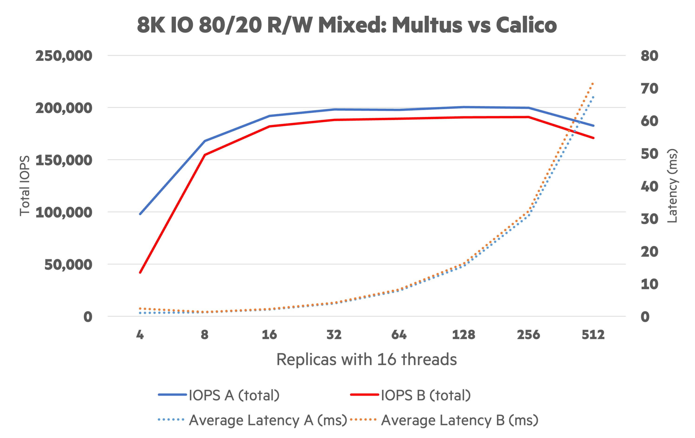

# NFS Server Provisioner IO Performance

Determine performance delta between using Multus and Calico for NFS client/server traffic. Many other permutations of the final configuration were run but this is a sample test.

## Configuration

Using benk-v0.0.1 to scale a mixed workload.

```text
benkWaitForPVCs=1
pvcVolumeSize=512Gi
workloadRuntime=60
workloadWorkingSetSize=512M
workloadThreads=16
pvcPersistPVC=1
pvcAccessMode=ReadWriteMany
workloadDeleteFiles=1
# Change these
workloadPattern=randrw
workloadReadPercentage=80
workloadBlockSize=8k
workloadReplicas=%workload%
```

Start `workloadReplicas` at `4` and double each iteration up to `512`.

```bash
export workload=4
for i in {1..8}; do
  cp -a kustomize/overlays/default kustomize/overlays/example-${i}
  sed -e "s/%workload%/${workload}/g" examples/nfs-io-performance/config.env > kustomize/overlays/example-${i}/config.env
  workload=$((2 * ${workload}))
done
```

```text
./sequencer.sh example-
```

## Report

Create the output.

```text
./src/benk/outputter.py -a examples/nfs-io-performance/a.log -b examples/nfs-io-performance/b.log -t examples/nfs-io-performance/template.tsv.j2
```

The output is in TSV and is meant to pasted into a spreadsheet.

## Example Rendering


