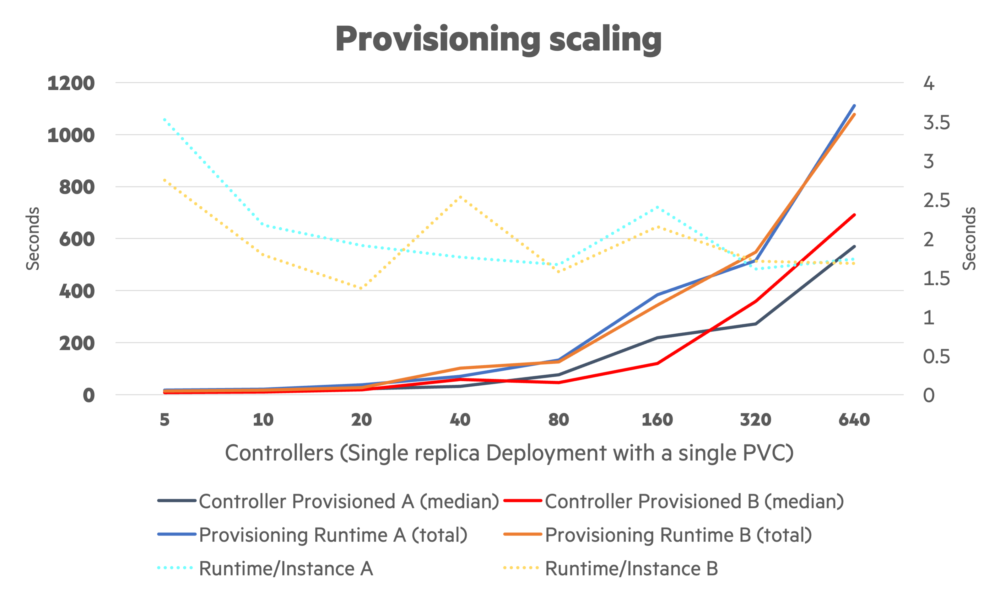

# Provisioning Performance

An investigation needed to be carried out on how many PVCs can be provisioned and subsequently attached to a workload to better help size clusters and workloads that depend on persistent storage.

## Configuration

Using benk-v0.0.1 to scale PVCs. A/B testing was conducted with 1Gi and 2Ti `pvcVolumeSize`.

```text
pvcVolumeSize=1Gi
workloadInstances=%workload%
workloadNoOp=1
```

Start `workloadInstances` at `5` and double each iteration up to `640`.

```bash
export workload=5
for i in {1..8}; do
  cp -a kustomize/overlays/default kustomize/overlays/example-${i}
  sed -e "s/%workload%/${workload}/g" examples/provisioning-performance/config.env > kustomize/overlays/example-${i}/config.env
  workload=$((2 * ${workload}))
done
```

Re-run with a different size `pvcVolumeSize` or simply re-run the sequence to get two data points for the reporting template.

## Report

Create the output from log files.

```text
./src/benk/outputter.py -a examples/provisioning-performance/a.log -b examples/provisioning-performance/b.log -t examples/provisioning-performance/template.tsv.j2
```

The output is in TSV and is meant to pasted into a spreadsheet.

## Example Rendering


